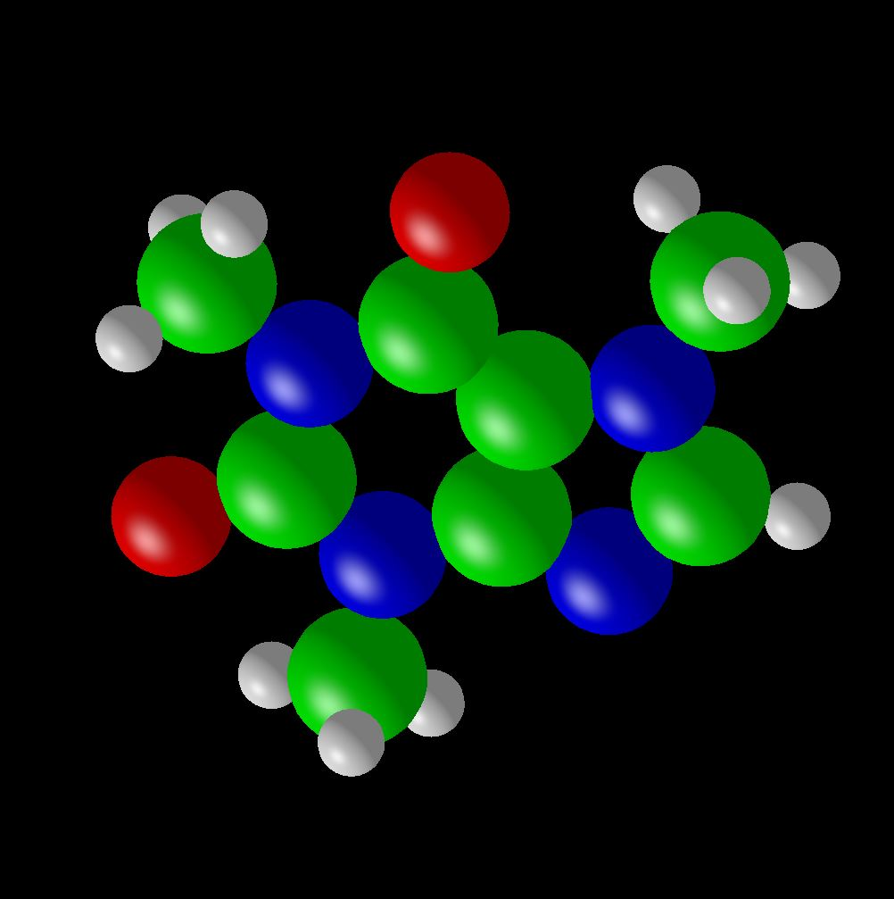

# Vulkan-Caffeine

This project demonstrates Vulkan instancing by implementing a sphere object to create the caffeine molecular structure.



The type of molecule is structured by radius and color, provided in the `molecule.cpp` file. The video demonstrating this project can be found here: https://youtu.be/qhHmLKId7do

---

## Keyboard commands:
* `'i', 'I'`: Toggle using a vertex buffer only vs. a vertex/index buffer
* `'l', 'L'`: Toggle lighting off and on
* `'m', 'M'`: Toggle display mode (molecule colors vs swirly texture)
* `'p', 'P'`: Pause the animation
* `'q', 'Q'`: Esc: exit the program
* `'r', 'R'`: Toggle rotation-animation and using the mouse
* `'o', 'O'`: Switch between orthographic and perspective

This code occassionally uses #defines for environment-specific-isms:

`_WIN32`		Windows

`__linux__`    Linux

`__GNUC__`	GNU compiler


There are some pieces of the program that were tossed in to show how to do some things
they are not necessary in the program
#define them to turn them on, #undef them to turn them off
#undef EXAMPLE_OF_USING_DYNAMIC_STATE_VARIABLES

```There are also some spots where options are listed just to show you what could have happened here:
VkPipelineStageFlags waitAtBottom = VK_PIPELINE_STAGE_BOTTOM_OF_PIPE_BIT;
#ifdef CHOICES
VK_PIPELINE_STAGE_TOP_OF_PIPE_BIT = 0x00000001,
VK_PIPELINE_STAGE_DRAW_INDIRECT_BIT = 0x00000002,
. . .
#endif
```

---
 
Source code (Window creation, keyboard commands, etc) provided by Dr. Bailey.
 
Mike Bailey, Oregon State University
mjb@cs.oregonstate.edu

The class notes for which this program was written can be found here:
http://cs.oregonstate.edu/~mjb/vulkan